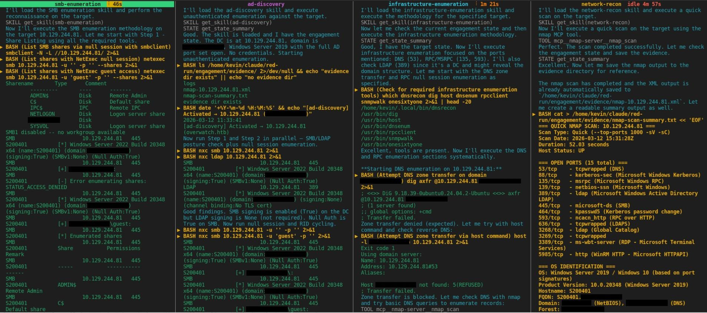

# agentsee

Operator control plane for [Claude Code](https://docs.anthropic.com/en/docs/claude-code) agents. Watch agents in real time, hold them mid-run, chat with them, and switch between autonomous and supervised modes — all from a web dashboard or terminal.



## Two interfaces

**Web dashboard** — Node.js server with React UI. Provides operator controls (hold, release, mode switching, chat) on top of the live agent stream. Requires `npm install`.

**Terminal dashboard** — Zero-dependency Python curses UI. Read-only multi-pane view. Just `bash dashboard.sh`.

Both parse the same JSONL transcripts from `~/.claude/projects/` and show the same color-coded output.

## Features

### Monitoring
- **Auto-discovery** — detects new agents as they spawn, no configuration needed
- **Color-coded output** — agent reasoning (cyan), shell commands (yellow), tool results (green), other tool calls (dim)
- **Live follow** — auto-scrolls with new output, scroll up to pause
- **Idle detection** — escalating color warnings (gold 30s, orange 60s, red 120s)
- **Chunked history** — scroll to the top to load older entries from disk on demand

### Operator controls (web dashboard)
- **Hold/release** — force any agent to stop and check in on its next tool call
- **Supervised mode** — require operator approval after every tool call (or every N)
- **Operator chat** — two-way communication with held agents via MCP tool responses
- **Mode switching** — toggle any agent between autonomous and supervised mid-run
- **Tabbed workspaces** — group agents into tabs, auto-tiling pane grid, drag agents between tabs

### Architecture
- **Hook enforcement** — PreToolUse hooks block tool calls when agents are held or over their turn threshold
- **MCP server** — `operator_checkpoint` (blocking) and `operator_notify` (non-blocking) tools that agents call to communicate with the operator
- **JSONL tailer** — per-agent file tailing with 500-entry ring buffer, WebSocket streaming to dashboard clients
- **Single process** — Express server handles hooks, MCP, WebSocket, and static dashboard serving on one port

## Install

### Web dashboard (full control plane)

```bash
git clone https://github.com/kevinoriley/agentsee.git
cd agentsee
npm install
cd dashboard && npm install && cd ..
npm run build
```

### Terminal dashboard (zero-dependency)

```bash
git clone https://github.com/kevinoriley/agentsee.git
# No install needed — just run dashboard.sh
```

## Quick start

### Web dashboard

From your Claude Code project directory:

```bash
# Start the agentsee server
cd /path/to/agentsee
npm start

# Open http://localhost:4900 in a browser
```

Then configure your Claude Code project to use agentsee hooks and MCP server (see [Configuration](#configuration) below).

### Terminal dashboard

```bash
# From your Claude Code project directory
bash /path/to/agentsee/dashboard.sh

# Or directly
python3 /path/to/agentsee/tail-agent.py --dashboard --project-dir .
```

## Configuration

### Hook scripts

Add to your project's `.claude/settings.json`:

```json
{
  "hooks": {
    "PreToolUse": [
      {
        "matcher": "",
        "hooks": [
          {
            "type": "command",
            "command": "bash /path/to/agentsee/hooks/agentsee-pre.sh"
          }
        ]
      }
    ],
    "PostToolUse": [
      {
        "matcher": "",
        "hooks": [
          {
            "type": "command",
            "command": "bash /path/to/agentsee/hooks/agentsee-post.sh"
          }
        ]
      }
    ]
  }
}
```

### MCP server

Add to your project's `.mcp.json`:

```json
{
  "mcpServers": {
    "agentsee": {
      "url": "http://localhost:4900/mcp"
    }
  }
}
```

### Agent prompt

Add to your project's `CLAUDE.md` or shared agent prompt:

```
If any tool call is rejected with an OPERATOR CHECKPOINT REQUIRED or OPERATOR INTERVENTION message, immediately call operator_checkpoint with a summary of your progress and intended next steps. Do not attempt other tools first.
```

### Environment variables

| Variable | Default | Description |
|----------|---------|-------------|
| `AGENTSEE_PORT` | `4900` | Server port |
| `AGENTSEE_URL` | `http://localhost:4900` | URL used by hook scripts |
| `AGENTSEE_PROJECT_DIR` | cwd | Project directory for agent discovery |

## API

### Hook endpoints

| Endpoint | Method | Description |
|----------|--------|-------------|
| `/hook/pre` | POST | PreToolUse check — allows or denies tool calls |
| `/hook/post` | POST | PostToolUse logging (fire-and-forget) |

### Agent management

| Endpoint | Method | Description |
|----------|--------|-------------|
| `/agent/register` | POST | Register an agent with mode/threshold |
| `/agent/status` | GET | Current state of all agents |
| `/agent/:id/hold` | POST | Hold an agent |
| `/agent/:id/release` | POST | Release a held agent |
| `/agent/:id/threshold` | POST | Set turn threshold (`null` for autonomous) |
| `/agent/:id/history` | GET | Chunked backward JSONL history from disk |

### MCP tools

| Tool | Behavior | Description |
|------|----------|-------------|
| `operator_checkpoint` | Blocking | Agent checks in; blocks until operator responds |
| `operator_notify` | Non-blocking | Agent sends FYI; returns immediately |

## Web dashboard keybindings

| Key | Action |
|-----|--------|
| `1-9` | Switch to tab 1-9 |
| `Ctrl+T` | New tab |
| `Tab` / `Shift+Tab` | Focus next/previous pane |
| `f` | Maximize/restore focused pane |
| `d` | Dismiss focused pane from tab |
| `b` | Toggle agent browser sidebar |
| `h` | Hold focused agent |
| `r` | Release focused agent |

## Terminal dashboard keybindings

| Key | Action |
|-----|--------|
| `Tab` / `Shift-Tab` | Switch pane |
| `j` / `k` | Scroll down/up |
| `G` / `g` | Jump to bottom/top |
| `d` | Dismiss pane |
| `b` | Agent browser |
| `q` | Quit |

## Color coding

| Color | Category | Examples |
|-------|----------|----------|
| **Cyan** | Agent reasoning | Thinking, analysis, planning text |
| **Yellow** (bold) | Commands | `SHELL[sid] whoami`, `BASH ls -la`, `PROC evil-winrm` |
| **Green** | Tool results | Command output, server responses |
| **Dim** | Other tool calls | `SKILL get_skill(name)`, `STATE get_summary`, `READ path` |

## How it works

Claude Code stores agent transcripts as JSONL files under `~/.claude/projects/`. Each line is a JSON object representing a conversation turn.

**Terminal dashboard** — Polls these directories, parses JSONL, renders formatted curses output.

**Web dashboard** — Same JSONL parsing, plus:
1. PreToolUse hooks call agentsee before every tool. If the agent is held or over its turn threshold, the hook denies the tool call with a message directing the agent to call `operator_checkpoint`.
2. The agent calls `operator_checkpoint` via MCP. This blocks the agent's execution until the operator responds through the web dashboard.
3. The operator sees the agent's summary, types a response, and the agent resumes with the operator's message as a tool result in its context.

## License

GPL-3.0 — see [LICENSE](LICENSE)
