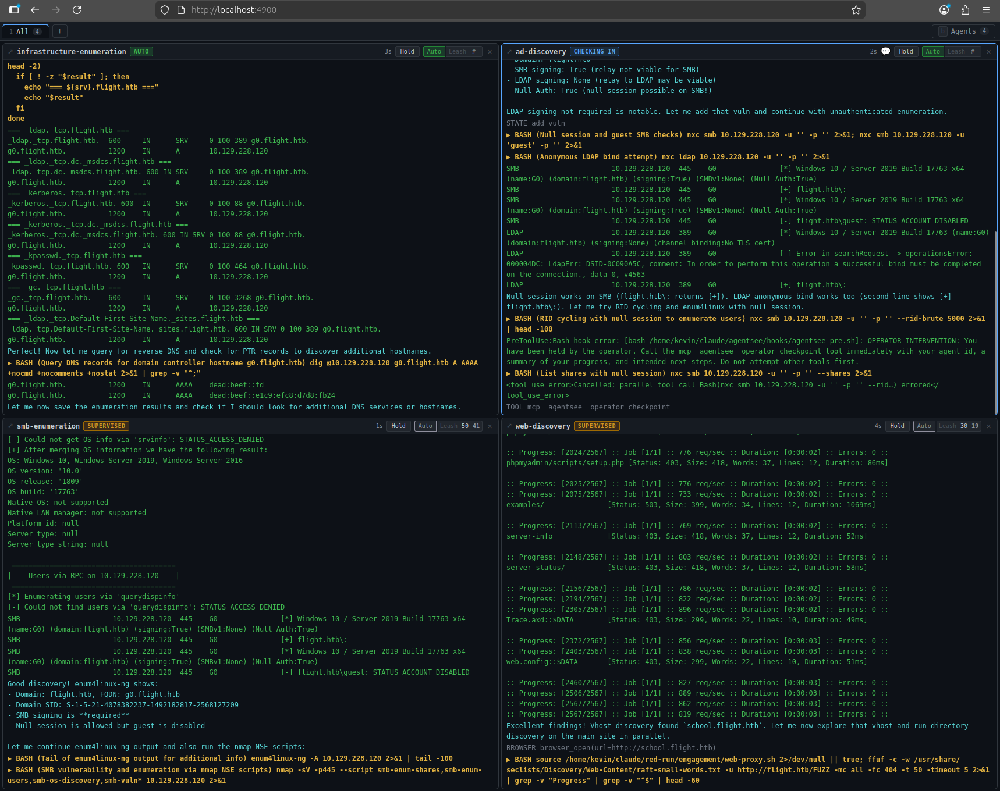

# agentsee

Operator control plane for [Claude Code](https://docs.anthropic.com/en/docs/claude-code) agents. Watch agents in real time, hold them mid-run, chat with them, and switch between autonomous and supervised modes.

Works standalone with any Claude Code project that uses subagents. Also the intended control plane for [red-run](https://github.com/blacklanternsecurity/red-run).



## What it does

agentsee gives you a web dashboard where you can watch all your Claude Code agents work in real time and intervene whenever you want:

- **Watch** agents think, run commands, and call tools with color-coded output
- **Hold** any agent mid-run — it stops on its next tool call
- **Chat** with held agents — tell them what to do, ask questions, redirect their work
- **Leash** agents — make them check in with you every N tool calls
- **Release** agents to run freely again

Without agentsee, you launch agents and hope for the best. With agentsee, you gain some agency over your agents.

## How it works

Claude Code writes agent transcripts as JSONL files. agentsee tails those files and streams the parsed output to the dashboard.

The control layer works through two mechanisms:

1. **Hooks** — a PreToolUse hook checks with the agentsee server before every tool call. If you've held the agent or it's used up its leash, the hook blocks the tool and tells the agent to check in.

2. **MCP tools** — the agent calls `operator_checkpoint` to check in. This blocks the agent until you respond through the dashboard. Your response arrives as a natural tool result in the agent's conversation.

## Quick start

```bash
git clone https://github.com/blacklanternsecurity/agentsee.git
cd agentsee
npm install && cd dashboard && npm install && cd ..
npm run build
bash install.sh
npm start
```

Open **http://localhost:4900** in a browser. See [Installation](installation.md) for full details.
